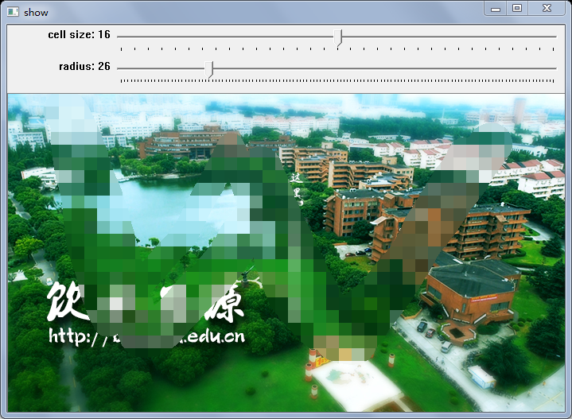

# 马赛克 Mosaic

给图片局部区域添加马赛克效果。[Mosaic.cpp](Mosaic/Mosaic.cpp) 中给出了两种实现方法，一种是使用 OpenCV 函数实现的 `mosaicSimple` 函数，另一种是通过指针访问内存进行计算实现的 `mosaic` 函数。调用 `main1` 函数测试可以发现，第二种实现的运行速度要快很多。

主函数运行后，可以在画面上单击鼠标拖动，鼠标经过的区域就会出现马赛克效果。界面上能够调节马赛克网格尺寸，和马赛克笔触的宽度。按字母 e 清空当前马赛克，按字母 s 保存当前图片，按字母 q 退出。

程序依赖 OpenCV 2.0 或者以上版本。

2015 年 4 月，当时有同事需要实现这个功能。那位同事做了好长时间效果都不好，我一个下午花了不到两小时做了一个 demo 给他看了。那个程序我没留下来。2016 年下半年不知道哪天，我又写了一遍基本函数。今天加上了交互式的展示。
